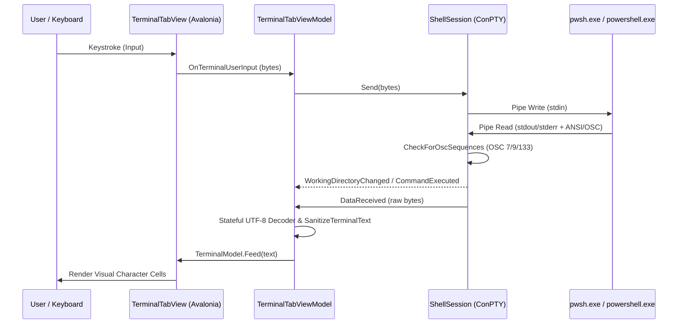

# MultiShell Architecture & Design Specification

This document provides a comprehensive technical overview of the architecture, design patterns, subsystem boundaries, and data flows in **MultiShell**.

---

## 1. Architectural Philosophy

MultiShell is built in **C# 13**, **.NET 10.0**, and **Avalonia UI 11.2** adhering strictly to **Clean Architecture** and **Clean Code** principles:

```
MultiShell Solution
├── Models/                     # Core Domain Layer (Entities, DTOs, State Records)
├── Services/                   # Application & Infrastructure Layer (Contracts & Implementations)
├── ViewModels/                 # Presentation Layer (MVVM using CommunityToolkit.Mvvm)
├── Views/                      # UI Rendering Layer (Avalonia XAML Views & Controls)
└── MultiShell.Tests/           # Automated Test Suite (xUnit with AAA Pattern)
```

### Core Architecture Invariants:
1. **Dependency Rule**: Dependencies point inward. Domain models and service contracts are decoupled from Avalonia UI controls.
2. **Framework Decoupling**: ViewModels hold observable state and commands without referencing concrete UI controls (`Visual`, `Window`, `Control`).
3. **Compiled Bindings**: All XAML views use compiled bindings (`x:DataType`) for compile-time safety and peak runtime performance.
4. **Bilingual Localization**: Zero hardcoded user-facing strings; all UI texts are resolved dynamically via `LocalizationService` (German `de`, English `en`, French `fr`, Spanish `es`).
5. **Native P/Invoke Encapsulation**: Win32 ConPTY and kernel32 handles are encapsulated in `SafeHandle` instances with leak-free disposal lifecycles.

---

## 2. Layer Structure & Responsibilities

### 2.1 Domain Layer (`Models/`)
* **`TabState.cs`**: Immutable records (`WorkspaceState`, `PersistedTabState`) for atomic serialization.
* **`LanguageOption.cs`**: Strongly-typed language descriptor record (`Code`, `NativeName`, `EnglishName`).
* **`MultiShellJsonSerializerContext.cs`**: High-performance AOT-ready JSON source-generation context (`System.Text.Json`).

### 2.2 Service & Infrastructure Layer (`Services/`)
* **`IShellSession` / `ShellSession.cs`**:
  * Manages the Win32 PseudoConsole (ConPTY) lifecycle via `CreatePseudoConsole`, `ResizePseudoConsole`, and `ClosePseudoConsole`.
  * Encapsulates I/O pipe handles and streams (`_inputStream`, `_outputStream`).
  * Employs stateful UTF-8 decoding (`_outputDecoder`) to prevent fragmented multi-byte character corruption.
  * Intercepts shell integration escape sequences in real time:
    * **OSC 9;9**: `\x1b]9;9;"<path>"\x07` (PowerShell working directory tracking).
    * **OSC 7**: `\x1b]7;file://<path>\x07` (WSL / POSIX working directory tracking).
    * **OSC 133;E**: `\x1b]133;E;<base64-command>\x07` (Executed command tracking).
* **`IPowerShellProcessService` / `PowerShellProcessService.cs`**:
  * Factory service for creating isolated shell sessions across configured shell profiles.
* **`ITerminalProfileService` / `TerminalProfileService.cs`**:
  * Manages configured terminal profiles (PowerShell, NuShell, WSL, CMD, custom executables) with persistence.
* **`IThemeService` / `ThemeService.cs`**:
  * Manages independent App UI theme variants (`ThemeVariant.Dark` / `ThemeVariant.Light`) and Terminal palettes.
* **`ILocalizationService` / `LocalizationService.cs`**:
  * Provides dynamic multi-language string resolution with OS language detection and user preference persistence.
* **`IFuzzySearchService` / `FuzzySearchService.cs`**:
  * Fast subsequence fuzzy matching engine with match scoring for live history filtering.
* **`ITabStatePersistenceService` / `TabStatePersistenceService.cs`**:
  * Thread-safe atomic JSON file persistence (`%LOCALAPPDATA%/MultiShell/tabs_state.json`) with safe temporary swap files.

### 2.3 Presentation Layer (`ViewModels/`)
* **`ViewModelBase.cs`**: Base `ObservableObject` for CommunityToolkit.Mvvm notifications.
* **`MainViewModel.cs`**:
  * Root orchestrator managing tab collection (`ObservableCollection<TerminalTabViewModel>`), active tab selection, settings menu, modal dialogs, and workspace state persistence.
* **`TerminalTabViewModel.cs`**:
  * Backs an individual terminal tab. Bridges `IShellSession` events to `TerminalControlModel`.
  * Maintains live command history (`CommandHistory`), directory history (`DirectoryHistory`), and fuzzy-filtered views.
  * Tracks keyboard state (e.g. `IsAltGrActive` for international layout compatibility).

### 2.4 Presentation Layer (`Views/`)
* **`MainWindow.axaml` / `MainWindow.axaml.cs`**:
  * Main window container, top toolbar, 30px draggable tab bar, left-edge slide-out History Drawer, and modal overlay dialogs (Help, About, Profiles).
* **`TerminalTabView.axaml` / `TerminalTabView.axaml.cs`**:
  * Terminal view hosting `SvcSystems.UI.Terminal`.
  * Manages Xterm 16-color and 24-bit TrueColor palette synchronization, right-click copy/paste, and focus dispatch.

---

## 3. Win32 ConPTY Streaming & Data Flow



---

## 4. Encoding, Codepages & Font Hierarchy

* **Process-Wide UTF-8**: Windows Application Manifest ([`app.manifest`](app.manifest)) declares `<activeCodePage>UTF-8</activeCodePage>`.
* **Win32 Console Codepage**: Shell initialization script executes `chcp 65001 >$null` and sets `[Console]::OutputEncoding = UTF8`.
* **Font Fallback Hierarchy**:
  `Cascadia Code NF, Cascadia Mono NF, Cascadia Code, Cascadia Mono, Consolas, Segoe UI Symbol, DejaVu Sans Mono, monospace`
