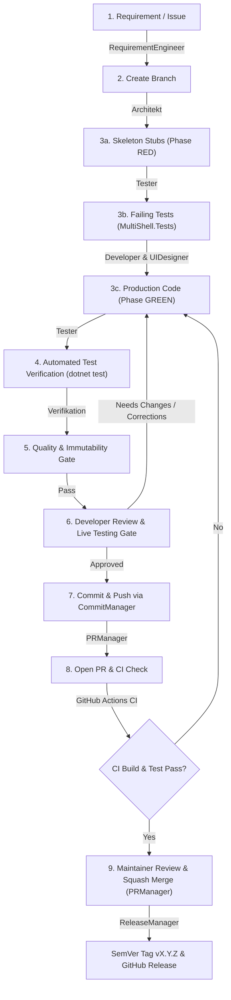

# MultiShell Contribution & Development Workflow Guide

This document outlines the development workflow, branching strategy, Pull Request (PR) standards, subagent collaboration model, and release management policies for the **MultiShell** repository.

---

## 1. Branching Strategy (Trunk-Based / Feature Branching)

MultiShell follows a lightweight **Trunk-Based / GitHub Flow** branching model with `main` as the sole stable production branch.

### 1.1 Branch Naming Conventions

All changes must be developed in dedicated feature, fix, or maintenance branches branched off the latest `main`:

| Prefix | Category | Example | Purpose |
| :--- | :--- | :--- | :--- |
| `feat/` | New Feature | `feat/REQ-025-tab-split-view` | New feature specified in `REQUIREMENTS.md`. |
| `fix/` | Bug Fix | `fix/BUG-014-conpty-leak` | Bug fix, crash remediation, or exception fix. |
| `refactor/` | Refactoring | `refactor/clean-terminal-session` | Code cleanup with no functional behavior changes. |
| `perf/` | Performance | `perf/zero-alloc-conpty-buffer` | Memory allocation or throughput optimization. |
| `docs/` | Documentation | `docs/update-architecture-guide` | XML doc comments, markdown guides, architecture specs. |
| `chore/` | Tooling & CI | `chore/dotnet-10-package-bump` | Build script updates, GitHub Actions, dependencies. |

### 1.2 Repository Setup & Git Submodules

This repository uses [histore/agent-skills](https://github.com/histore/agent-skills) as a Git submodule at `_agents`.

When cloning for the first time:
```powershell
git clone --recurse-submodules https://github.com/histore/multishell.git
```

If already cloned without submodules:
```powershell
git submodule update --init --recursive
```

To update agent skills to their latest version:
```powershell
git submodule update --remote _agents
```

---

## 2. End-to-End Development Lifecycle

Every code change moves through a structured, quality-gated 9-stage lifecycle adhering to **Stub-First Test-Driven Development (TDD)**:



### Stage 1: Requirement Specification (`RequirementEngineer`)
- Verify that every user story is documented in [REQUIREMENTS.md](REQUIREMENTS.md) with explicit **Given-When-Then** acceptance criteria.
- 100% of functional changes must map to approved requirement IDs (e.g., `REQ-HIST-002`).

### Stage 2: Branch Creation
```powershell
git checkout main
git pull origin main
git checkout -b feat/REQ-025-tab-split-view
```

### Stage 3: Stub-First TDD Implementation (`Architekt`, `Tester`, `Developer` & `UIDesigner`)
MultiShell adheres strictly to **Stub-First Test-Driven Development (TDD)** (Red-Green-Refactor):
- **Phase RED (Stubs & Failing Tests)**:
  - The `Architekt` defines interfaces and compiles skeleton stubs throwing `NotImplementedException`.
  - The `Tester` implements xUnit unit/integration tests in [MultiShell.Tests](MultiShell.Tests/) adhering to the Arrange-Act-Assert (AAA) pattern *before* production logic is written, verifying that tests compile cleanly and fail semantically.
- **Phase GREEN (Production Code)**:
  - The `Developer` (and `UIDesigner`) implement domain logic, services, view models, and views strictly to turn failing tests green.
  - **Test Immutability Constraint**: The developer is strictly forbidden from altering test files or relaxing assertions.
  - **Circuit Breaker**: The local feedback loop (`Code` -> `dotnet test` -> `Fix`) is capped at a maximum of 3 iterations before escalating.
  - Respect layer separation:
    - **Models**: Pure domain objects, DTOs, and serialization models.
    - **Services**: Interfaces (`I...Service`) and infrastructure implementations (ConPTY Win32 bindings, theme manager, fuzzy search).
    - **ViewModels**: CommunityToolkit.Mvvm presentation logic decoupled from Avalonia UI controls.
    - **Views**: Compiled bindings (`x:DataType`), decoupled styles, zero business logic in code-behind.
  - **i18n Compliance**: Zero hardcoded UI strings; all user-facing texts must be referenced in dynamic localization dictionaries (German `de` & English `en` mandatory).

### Stage 4: Automated Testing Verification (`Tester`)
- Execute the full automated test suite locally:
  ```powershell
  dotnet test MultiShell.Tests/MultiShell.Tests.csproj
  ```
- A 100% pass rate with 0 failures is strictly required before verification handoff.

### Stage 5: Local Quality & Security Gate Audit (`Verifikation` & `SecurityAuditor`)
- Verify 0 test failures, 0 compiler warnings, clean formatting, and **test immutability compliance**.
- Confirm full requirement coverage and bilingual localization resources.
- **Security & Secret Audit (`SecurityAuditor`)**:
  - Audit staged diffs for accidental credentials, tokens, or private keys.
  - Verify dependency health and CVE status:
    ```powershell
    dotnet list MultiShell.slnx package --vulnerable --include-transitive
    ```

### Stage 6: Developer Review & Live Testing Gate (Manual Verification & Pre-PR Iteration)
- Prior to staging commits and creating a Pull Request, the working state is presented to the developer/user for interactive review:
  - **Manual/Interactive Testing**: The developer can launch and run the application locally to verify real-world ergonomics, keyboard workflows, and terminal behavior.
  - **Code Review & Feedback**: The developer inspects code diffs and can request modifications, design adjustments, or edge-case handling.
  - **Pre-PR Corrections**: If issues are found, the subagents (`Developer`, `UIDesigner`, `Architekt`, `Tester`, `SecurityAuditor`) immediately iterate and apply corrections before any PR is created or merged.
  - **Explicit Approval**: Once the developer confirms that the feature functions as expected, the workflow proceeds to Stage 7.

### Stage 7: Conventional Commit & Push (`CommitManager`)
- Stage and commit changes using the **Conventional Commits** specification:
  - Format: `<type>(<scope>): <summary>`
  - Example: `feat(terminal): add tab split view and layout persistence`
- Push to the upstream feature branch:
  ```powershell
  git push -u origin feat/REQ-025-tab-split-view
  ```

### Stage 8: Pull Request Creation & CI Check (`PRManager`)
- Open a Pull Request targeting `main` using the structured template [`.github/pull_request_template.md`](.github/pull_request_template.md):
  ```powershell
  gh pr create --title "feat(terminal): add tab split view" --body "<filled-pr-template>"
  ```
- Monitor GitHub Actions CI build and test results:
  ```powershell
  gh pr checks
  ```

### Stage 9: Maintainer Review, Squash Merge & Release (`PRManager` & `ReleaseManager`)
- The project maintainer reviews the PR and executes a **Squash and Merge** with branch deletion:
  ```powershell
  gh pr merge --squash --delete-branch
  ```
- `ReleaseManager` verifies milestones and tags releases upon user confirmation per [Section 5](#5-release--versioning-policy-releasemanager).

---

## 3. Lifecycle Action Execution Governance

Operations involving Git and releases (`commit`, `push`, `pr merge`, `release`) adhere to six governance principles:

1. **Strict Action Execution (Atomic Scope)**: An explicitly requested action executes only that action without unsolicited side-actions (e.g. committing never triggers an automatic push).
2. **State-Driven Prerequisite Resolution**: If an action requires preceding state changes (e.g. uncommitted workspace changes when `push` is requested, or unpushed commits before PR creation), prerequisites are resolved automatically.
3. **Proactive Next-Step Offering**: After completing an action, the logical successor step is proactively recommended to the user for immediate execution.
4. **Gate Invariance**: Mandatory interactive review gates (commit message confirmation, PR description approval, release tag verification) are never bypassed.
5. **Explicit User Override**: Explicit user instructions can combine or alter default actions at any time.
6. **Atypical State & Safety Confirmation Gate**: If following these instructions produces an unexpected state or requires non-standard measures (e.g. detached HEAD, merge conflicts, unexpected untracked files, unverified release states), the agent halts, describes the situation, and requests explicit user confirmation before proceeding.

---

## 4. Pull Request Standards & Quality Gates

Every Pull Request must fill out [.github/pull_request_template.md](.github/pull_request_template.md):

* **Traceability**: Must reference the linked issue or requirement (`REQ-XXX`).
* **Clean History**: PRs are merged via **Squash and Merge** to maintain a linear Git history on `main`.
* **Branch Cleanup**: Remote feature branches should be automatically or manually deleted post-merge.

---

## 5. Release & Versioning Policy (`ReleaseManager`)

MultiShell adheres to **Semantic Versioning 2.0.0** (`MAJOR.MINOR.PATCH`):
- **MAJOR**: Incompatible API or structural breaking changes.
- **MINOR**: Backward-compatible new features (`feat`).
- **PATCH**: Backward-compatible bug fixes (`fix`, `perf`).

### 5.1 Main-Branch Release Enforcement
Releases must **strictly and exclusively** be tagged and created from the `main` branch:
1. **Local Pre-Check (`ReleaseManager`)**: Before calculating versions and creating tags, the working branch is checked to ensure it is `main` and fully synchronized with `origin/main`.
2. **CI/CD Pipeline Gate ([.github/workflows/release.yml](.github/workflows/release.yml))**: When a tag (`v*.*.*`) is pushed, the GitHub Actions release workflow validates that the tag commit is an ancestor of `origin/main` (`git merge-base --is-ancestor`). Any release build triggered by non-main tags is immediately aborted.

When a release milestone is reached on `main`:
1. `ReleaseManager` verifies all merged PRs on `main` and proposes the SemVer version bump.
2. Upon user confirmation, an annotated Git tag (e.g. `v1.2.0`) is created and pushed on `main`.
3. [.github/workflows/release.yml](.github/workflows/release.yml) automatically triggers, validates that the tag belongs to `origin/main`, compiles single-file self-contained executables, builds the Inno Setup installer (`installer.iss`), and generates a GitHub Release.
