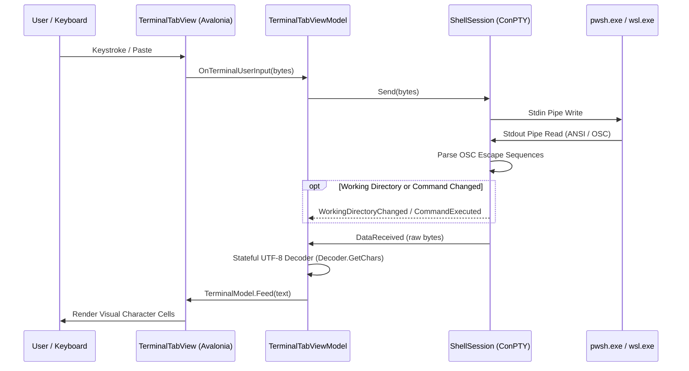

# MultiShell Architecture Overview

This document provides the high-level architecture specification for **MultiShell**, a modern multi-tab terminal emulator built with **C# 13**, **.NET 10.0**, and **Avalonia UI 11.2**.

---

## 1. System Purpose & Scope

MultiShell is a high-performance, developer-focused desktop terminal designed for Windows. It provides:
- Seamless multi-tab management with persistent process state.
- Integrated support for multiple shell environments (PowerShell 7, Windows PowerShell, WSL, CMD, NuShell).
- Direct Win32 ConPTY virtualization with zero-allocation UTF-8 stream processing.
- Rich developer workflow tooling: fuzzy command & directory history drawer, clickable URLs/paths, and dynamic font/theme controls.
- Full internationalization (i18n) across English, German, French, Spanish, Italian, and Portuguese.

---

## 2. Architecture & Layer Boundaries

MultiShell strictly adheres to **Clean Architecture** principles, enforcing separation of concerns across concentric layers:

```
┌─────────────────────────────────────────────────────────────────┐
│                    Presentation Layer (Views)                   │
│         MainWindow.axaml, TerminalTabView.axaml, Dialogs/       │
└───────────────────────────────┬─────────────────────────────────┘
                                │ Compiled Bindings (x:DataType)
┌───────────────────────────────▼─────────────────────────────────┐
│                 Presentation Layer (ViewModels)                 │
│    MainViewModel (Partial), TerminalTabViewModel, ViewModelBase │
└───────────────────────────────┬─────────────────────────────────┘
                                │ Dependency Injection / Contracts
┌───────────────────────────────▼─────────────────────────────────┐
│              Application & Infrastructure Services              │
│   ShellSession (ConPTY), LocalizationService, ThemeService,     │
│   TerminalProfileService, TabStatePersistenceService, etc.      │
└───────────────────────────────┬─────────────────────────────────┘
                                │ Domain Abstractions
┌───────────────────────────────▼─────────────────────────────────┐
│                      Domain Layer (Models)                      │
│        TerminalProfile, TabState, LanguageOption records        │
└─────────────────────────────────────────────────────────────────┘
```

### Core Invariants:
1. **Inward Dependencies**: Domain models (`Models/`) have zero external dependencies. Service contracts (`Services/`) depend only on domain models and standard .NET libraries.
2. **Framework Decoupling**: ViewModels (`ViewModels/`) contain presentation logic and reactive state, but never reference concrete UI controls (`Window`, `Control`, `Visual`).
3. **Compiled Bindings**: Avalonia XAML views use compiled bindings (`x:DataType`) for compile-time safety and peak runtime performance.
4. **Native Handle Encapsulation**: Low-level Win32 ConPTY and pipe handles are encapsulated in `SafeHandle` wrappers with deterministic disposal lifecycles.

---

## 3. Subsystem Modules Index

MultiShell's detailed technical specifications are modularized under [`modules/`](modules/):

| Module | Specification | Key Responsibilities |
| :--- | :--- | :--- |
| **Terminal Session & ConPTY** | [`terminal-session.md`](modules/terminal-session.md) | Win32 ConPTY lifecycle, pipe redirection, stateful UTF-8 decoding, OSC 7/9/133 shell integration. |
| **Presentation & MVVM** | [`presentation.md`](modules/presentation.md) | Avalonia UI composition, `MainViewModel` partials, `TerminalTabViewModel`, tab drag/drop, persistent panels. |
| **Profiles & Configuration** | [`profiles-and-configuration.md`](modules/profiles-and-configuration.md) | Shell profile detection, default profile seeding, JSON profile store. |
| **Workspace Persistence** | [`persistence.md`](modules/persistence.md) | Session serialization (`tabs_state.json`), atomic temp-swap writing, AOT-compliant System.Text.Json context. |
| **Internationalization (i18n)** | [`localization.md`](modules/localization.md) | 0% hardcoded strings, dynamic runtime language switching (EN, DE, FR, ES, IT, PT), fallback handling. |
| **Theming, Palettes & Fonts** | [`theming-and-styling.md`](modules/theming-and-styling.md) | Avalonia theme variants (Dark/Light), 16-color ANSI & 24-bit TrueColor palettes, dynamic font scaling. |
| **Fuzzy Search & Drawer** | [`search-and-drawer.md`](modules/search-and-drawer.md) | Subsequence fuzzy matching, slide-out History Drawer, interactive URL/path link detection. |

---

## 4. ConPTY Streaming Data Flow



---

## 5. Architectural Decision Records (ADR)
Significant architectural decisions and trade-offs are documented under [`adr/`](adr/).
